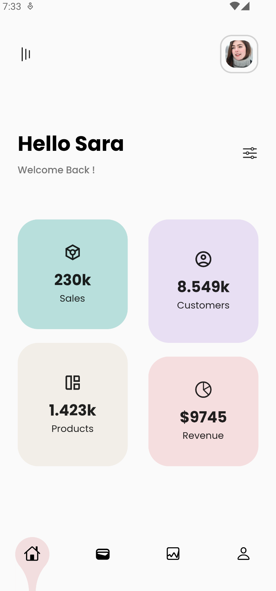

# UIContactSales

This project pursues the concept of a panel for a user where they can see quick information in the context of data, and can also extend to another page for more details.

## Authors

- [@NugetDePatto](https://github.com/NugetDePatto)
- [@badillovictor](https://github.com/badillovictor)
- [@ederjgb94](https://github.com/ederjgb94)
- [@Campus-TD](https://github.com/Campus-TD)

## Features

- Added Component cards
- Delayed display animation was incorporated
- The customized navigation bottom bar started
- Poppins font was used

## Color Reference

| Color             | Hex                                                                |
| ----------------- | ------------------------------------------------------------------ |
| Card Color 1 |  #B8DFDC |
| Card Color 2 |  #E8DFF3 |
| Card Color 3 |  #F2EEE8 |
| Card Color 4 |  #EF5DEDF |

## Screenshots

## Licenses

